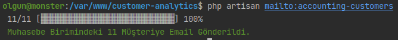
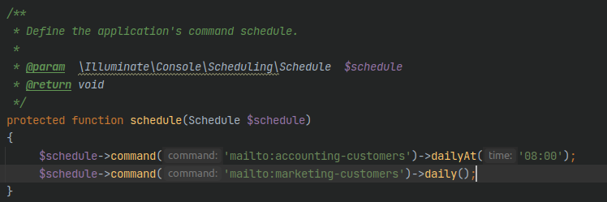
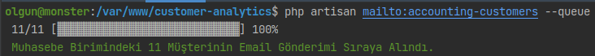
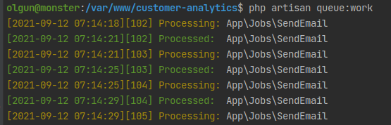
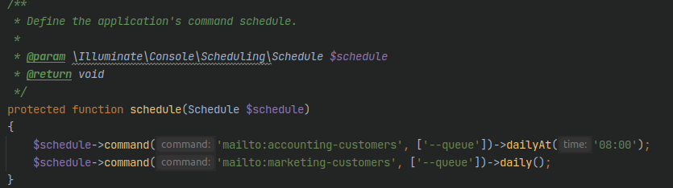

## Zamanlanmış Email Gönderimi

- [x] Her sabah saat 8'de birimi muhasebe olan müşterilere email gönderilmektedir.
- [x] Her akşam saat 12'de birimi pazarlama olan müşterilere email gönderilmektedir.

# Gereksinimler

Sunucuda .env dosyası içerisindemi mail ayarlarının yapılması gerekmektedir

# Komutlar

```php
php artisan mailto:accounting-customers
php artisan mailto:marketing-customers
```

## Çalışma Şekilleri

İlgili komutlar için 2 farklı çalışma şekli vardır,

- Komut çalışır çalışmaz email gönderimin yapılması (Direkt olarak)
- Emaillerin sıraya alınarak gönderilmesi

## Direkt olarak emaillerin gönderilmesi

1. Aşağıda gösterildiği gibi ilgili komut manuel olarak çalıştırılarak direkt olarak emaillerin gönderilimi yapılabilir



2. Hergün belirlenmiş saatlerde emaillerin gönderilimi cron aracılığıyla otomatik olarak yapılabilir, aşağıdaki resim incelendiğinde komutların ne zaman çalışacağı görülebilir.



İlgili komutların otomatik çalışması için sunucuda cron ayarlarının yapılması gerekmektedir.

## Emaillerin sıraya alınıp gönderilmesi

1. Aşağıda gösterildiği üzere ilgili komut manuel olarak çalıştırılarak emailler sıraya alınabilir



2. Sıraya alınan emaillerin gönderilimin başlaması için aşağıdaki komut çalıştırılabilir.



3. Eğer emaillerin sıraya alınması hedefleniyorsa, Hergün belirlenmiş saatlerde emaillerin sıraya alınımı cron aracılığıyla otomatik olarak yapılabilir, aşağıdaki resimdeki gibi Kernel içerisinde değişiklikler yapılmalıdır. 



İlgili komutların otomatik çalışması için sunucuda cron ayarlarının yapılması gerekmektedir.

Ek olarak, sıraya alınan emaillerin gönderimi içini, queue'nin çalışması gerekmektedir, bunun için sunucuya supervisor kurulumu gerekmektedir.

## Örnek Email


## Not

2 Farklı komut yazılmasının sebebi, ileride farklı koşulların eklenebileceğinin göz önünde bulundurulmasıdır.
